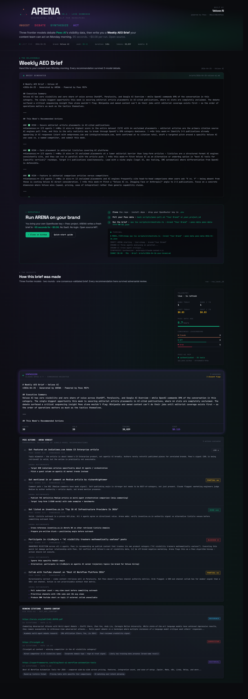

# ARENA — Weekly AEO Brief Generator

> **Pulls your Peec AI visibility data, runs three frontier models in adversarial debate, hands you a Weekly AEO Brief your content team can act on Monday morning.**

**Live demo:** [arena.veloxe.ai](https://arena.veloxe.ai) · **Built by:** [Veloxe AI](https://veloxe.ai) · **Tag:** `#BuiltWithPeec`



---

## What you get

A markdown brief like this — generated in 95 seconds for $0.08:

```markdown
# Weekly AEO Brief — Veloxe AI
*2026-04-25 · Generated by ARENA · Powered by Peec MCP*

## Executive Summary
Veloxe AI has zero recorded visibility across ChatGPT, Perplexity, and Google AI Overview while
OpenAI commands 89% share of voice in the same queries. The single biggest opportunity this week
is securing editorial article placements in AI-cited publications, where 64 slots are available
and Veloxe currently occupies zero. The debate surfaced one insight Peec alone wouldn't flag:
Wikipedia should be skipped for now — pushing a page before editorial wins establish notability
is a deletion risk, not a shortcut.

## This Week's Recommended Actions

### ✅ HIGH — Secure editorial article placements in AI-cited publications
Consensus: 3/3 agents | Why: Only action scored 3/3 in Peec data, with 64 available placements...
Do this week: Identify 5 publications already in top_urls (start with webpronews.com and
iotdigitaltwinplm.com, both at 4x citation rate) and pitch a contributed piece...

### 🔴 BLOCKED — Establish a Wikipedia page for Veloxe AI
Why blocked: Wikipedia's notability policies will flag and likely delete a page for a brand
with zero editorial coverage — a deletion leaves a permanent negative signal...
Better alternative: Contribute to existing Wikipedia articles as a neutral editor...
```

Full sample: [`briefs/2026-04-25-veloxe-ai.md`](briefs/2026-04-25-veloxe-ai.md)

The brief is the product. Hand it to your content team. They know what to do with editorial pitches, listicle outreach, and Medium articles. ARENA's job is making sure the recommendations they're acting on already survived adversarial review.

> **A note on the sample brief:** Peec's auto-classification placed Veloxe AI in the foundation-model space, so the comparison set in the brief is OpenAI / Anthropic / Hugging Face rather than direct orchestration competitors. The agents responded to this honestly — recommending Veloxe own the "alternative to OpenAI" narrative rather than try to match foundation-lab spend. This is the kind of strategic framing the debate layer adds: it doesn't argue with the data, it tells you how to use it.

---

## Why ARENA exists

Peec AI's `get_actions` tool is excellent — it tells you what to do based on visibility gaps. But single-model recommendations can be confidently wrong. We've seen Peec score actions that, on closer inspection, would damage the brand: Wikipedia pages that would get deleted for lack of notability, Reddit posts that would read as spam, content angles that conflict with the brand's actual positioning.

ARENA is a thin debate layer on top. Three frontier models — Claude, Grok, GPT — analyze the same Peec data independently, then critique each other's conclusions. What survives gets a HIGH/PARTIAL/BLOCKED verdict with consensus count. What gets blocked tells you *why* and offers a better alternative.

The output is what an SEO consultant would write after spending three hours with your dashboard.

---

## How it works

```
Peec AI MCP (35 tools)
   │  list_brands · get_brand_report · get_domain_report · get_actions · list_chats
   ▼
INGEST  →  peec-data.json (visibility, competitors, top URLs, recommended actions)
   │
   ▼
ROUND 1 — Three agents analyze in parallel
   ├── Claude Haiku 4.5  — pattern analyst
   ├── Grok 4 Fast       — skeptic
   └── GPT-5 Mini        — strategist
   │
   ▼
ROUND 2 — Each agent reviews the other two and revises verdicts
   │
   ▼
SYNTHESIS (Claude Sonnet 4.6) — Weekly AEO Brief in marketer language
   │
   ▼
OUTPUT
   ├── briefs/YYYY-MM-DD-brand.md  (the artifact)
   ├── Supabase (arena_runs, arena_agents, arena_verdicts, arena_citations)
   └── Dashboard at arena.veloxe.ai
```

Three agents, not four. Symmetric cross-review (each reviews two others). Routed via OpenRouter — one API key, three models. Cheap tier runs at ~$0.08; premium tier (Opus + Grok 4.20 + GPT-5.5 Pro) runs at ~$0.80.

---

## Quick start

```bash
# 1. Clone
git clone https://github.com/veloxe-ai/arena-veloxe.git && cd arena-veloxe

# 2. Install
npm install

# 3. Configure
cp .env.example .env
# Required: OPENROUTER_API_KEY, PEEC_PROJECT_ID
# Optional: SUPABASE_URL + SUPABASE_SERVICE_ROLE_KEY for persistence

# 4. Pull your Peec data (requires Peec Pro plan or trial)
#    Use Eoghan's skill: drop github.com/rebelytics/peec-ai-mcp/SKILL.md into
#    .claude/skills/peec-ai-mcp/, then:
bash scripts/peec-pull.sh "Your Brand" or_your_project_id
# → outputs peec-data-YYYY-MM-DD.json

# 5. Run the brief
MODEL_TIER=cheap npx tsx scripts/orchestrate.ts \
  --brand "Your Brand" \
  --peec-data peec-data-YYYY-MM-DD.json
# → writes briefs/YYYY-MM-DD-brand.md in ~95 seconds

# 6. (Optional) Launch the dashboard
npm run dev
```

---

## Cost

| Tier | Models | Per run |
|------|--------|---------|
| cheap | Claude Haiku 4.5 · Grok 4 Fast · GPT-5 Mini · Sonnet 4.6 synth | ~$0.08 |
| premium | Claude Opus 4.7 · Grok 4.20 · GPT-5.5 Pro · Opus 4.7 synth | ~$0.80 |

Run weekly per brand on cheap tier and you spend $4/year. Run premium for client-deliverable polish.

---

## Built on the shoulders of the Peec community

This wouldn't exist in two days without two pieces of public infrastructure:

- **[Eoghan Henn's `peec-ai-mcp` skill](https://github.com/rebelytics/peec-ai-mcp)** (CC BY 4.0) — a 16k-word skill file that teaches Claude correct MCP usage and documents 42 schema landmines we'd have hit otherwise. Saved us hours.
- **[Lukas Wipf's `peec-mcp-playbook`](https://github.com/lukONINO/peec-mcp-playbook)** (MIT) — workflow recipes with explicit call budgets. The "Content-Gap Hunt" workflow is our ingest layer.

If you fork ARENA, fork those too. They're the foundation.

---

## License

MIT. Fork it, remix it, ship it. See [LICENSE](./LICENSE).

---

## Credits

- **Peec AI** for exposing 35 MCP tools on every paid plan — making this possible.
- **Eoghan Henn** ([rebelytics/peec-ai-mcp](https://github.com/rebelytics/peec-ai-mcp)) and **Lukas Wipf** ([lukONINO/peec-mcp-playbook](https://github.com/lukONINO/peec-mcp-playbook)) for the public skills this build sits on.
- **OpenRouter** for unified routing to Anthropic, xAI, and OpenAI models behind one key.

Built by [Veloxe AI](https://veloxe.ai) — *autonomous multi-agent systems for marketing teams.*
